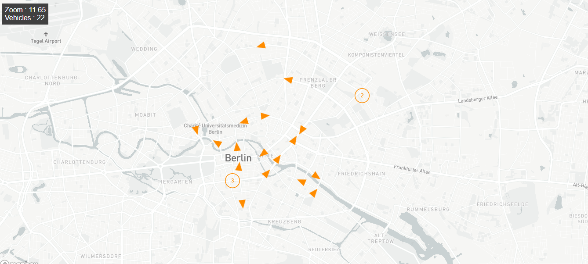

# d2d frontend app

## Overview
This application shows registered vehicles locations and directions on the map.
If last location of a vehicle is inside map boundaries but its distance to d2d center ( lat: 52.53, lng: 13.403) is more than 3.5 km, those are not shown.

Application is compatible with web and mobile

## Technologies
* React 
* Mapbox
* turf
* npm

## How it works
* When the application first loaded, map is centered at ( lat: 52.53, lng: 13.403) and zoom level is 10. 
* Periodically (0.5 seconds) calls backend service regarding map boundaries in order to retrieve vehicles by location with fetch function. 
* If there are vehicles returned from service those are marked on the map with orange dots.
* If zoom level is larger than 11.4 (when the user can see roads clearly), trianles used instead of dots in order to show vehicle direction.
* If there is single location data of a vehicle it is shown as dot since there is no way of calculating vehicle direction.
* The number of vehicles inside map boundaries is shown on a panel upper left corner of screen.

## Examples



## Installation

### Heroku
It is already deployed to Heroku. You can reach the application from the link below.
https://d2d-frontend-gungor.herokuapp.com

### Docker
First ensure that backend is running. See instructions: https://github.com/gungor/d2d-challenge-service  
Running the command below build Docker image file and runs in a comtainer.  
REACT_APP_SERVICE_URL environment variable provided to docker run command must be url of running backend service.  
By default REACT_APP_SERVICE_URL = https://d2d-backend-gungor.herokuapp.com  

* If your-backend-service-url contains 'localhost' or '127.0.0.1' replace it with 'host.docker.internal'

```bash
cd d2d-challenge-frontend
docker build -t d2d/frontend-gungor .
docker run -p 3000:3000 -e "REACT_APP_SERVICE_URL=your-backend-service-url" -t  d2d/frontend-gungor
```

Application can be reached from http://localhost:3000

### Local
```bash
npm install
```
* Windows
```bash
set REACT_APP_SERVICE_URL=your-backend-service-url
```

* Linux
```bash
export REACT_APP_SERVICE_URL=your-backend-service-url
```

```bash
npm start
```

Application can be reached from http://localhost:3000


