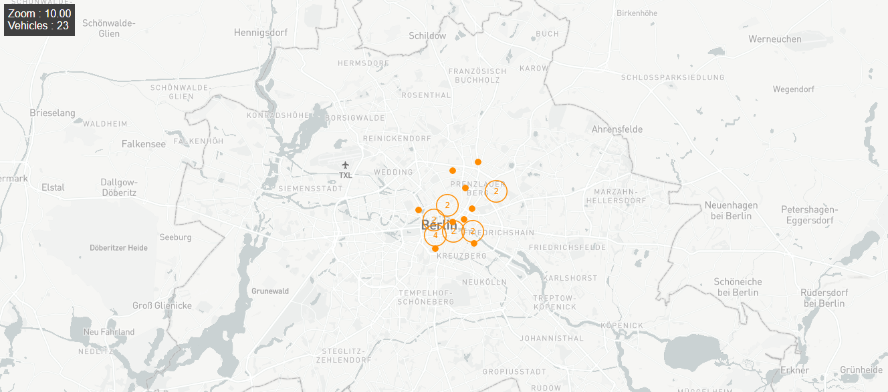

# d2d frontend app

## Overview
This application shows registered vehicles locations and directions on the map.
If last location of a vehicle is inside map boundaries but its distance to d2d center ( lat: 52.53, lng: 13.403) is more than 3.5 km, those are not shown.

## Technologies
* React 
* Mapbox
* turf
* npm

## How it works
When the application first loaded, map is centered at ( lat: 52.53, lng: 13.403) and zoom level is 10. 
Periodically (0.5 seconds) calls backend service regarding map boundaries in order to retrieve vehicles by location with fetch function. 
If there are vehicles returned from service those are marked on the map with orange dots.
If zoom level is larger than 11.4 (when the user can see roads clearly), trianles used instead of dots in order to show vehicle direction.
If there is single location data of a vehicle it is shown as dot since there is no way of calculating vehicle direction.
The number of vehicles inside map boundaries is shown on a panel upper left corner of screen.

## Examples

